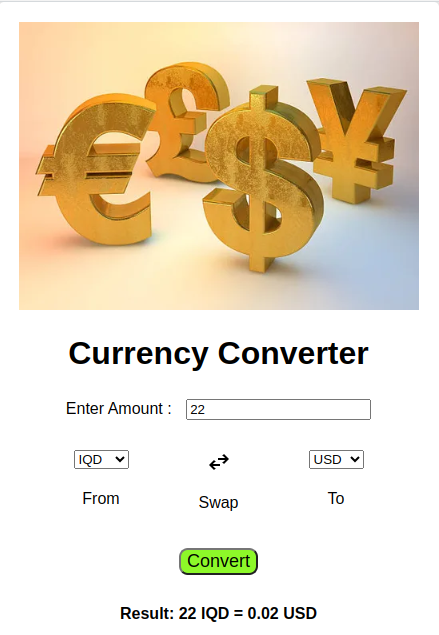

# Currency Calculator 
Currency Calculator is a simple web application that can enable a user to get timely data on the exchange rates of currencies all over the world. 
## Technologies Used

```
Git V 2.42.0
```
```
Visual Studio Code 
```
```
HTML
CSS
JAVASCRIPT
```

## Project Setup
1. To run my simple application that converts currencies, you need to;
```
git clone git@github.com:michaelkorir/Currency-Calculator.git
```
2. Run the application in your browser. You can use Live server which is an extension thats installed in Vs Code. 

3. You should see something like this;



## Contributing

Pull requests are welcome. For major changes, please open an issue first

to discuss what you would like to change.

Please make sure to update tests as appropriate.

## Author & License
MichaelKorir & [MIT LICENSE](LICENSE)